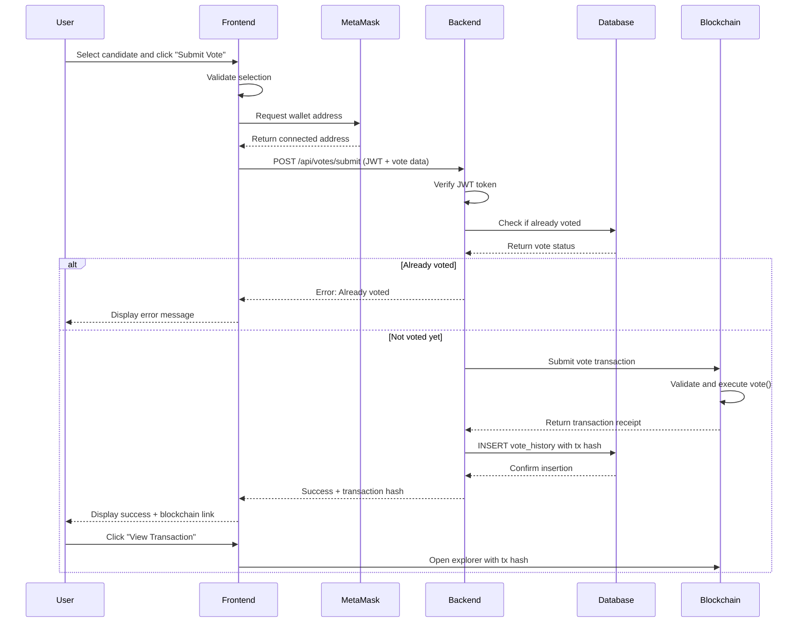

# 4.4 Execution

## 4.4.1 Smart Contract Implementation

### Core Voting Contract Structure

The blockchain-based e-voting system is built upon a Solidity smart contract deployed on the Hoodi Network (Ethereum-compatible blockchain). The smart contract serves as the immutable foundation for storing votes, managing elections, and ensuring data integrity. The contract implements a comprehensive voting mechanism that prevents tampering, double-voting, and unauthorized access through cryptographic verification and state management.

```solidity
// SPDX-License-Identifier: MIT
pragma solidity ^0.8.19;

contract VotingSystem {
    enum ElectionState { None, Created, Active, Ended }

    struct Election {
        string title;
        uint256 startTime;
        uint256 endTime;
        ElectionState state;
        uint256 totalVoters;
        uint256 totalVotes;
    }

    struct Voter {
        string studentId;
        string department;
        uint256 yearOfStudy;
        bool isRegistered;
        mapping(uint256 => bool) votedInCategory;
    }

    struct Candidate {
        uint256 id;
        string name;
        string party;
        uint256 voteCount;
        bool isActive;
        bool exists;
    }

    address public admin;
    Election public currentElection;

    mapping(address => Voter) private voters;
    mapping(uint256 => mapping(uint256 => Candidate)) private candidates;
}
```

_Figure 1: Smart Contract Core Data Structures_

The smart contract defines three primary data structures that form the backbone of the voting system. The `Election` struct encapsulates all election-related information including timing, state, and participation metrics. The `Voter` struct maintains voter registration details and tracks voting status across multiple categories using a nested mapping structure. The `Candidate` struct stores candidate information and vote tallies. These structures work together to create an immutable, transparent, and verifiable voting record on the blockchain.

### Vote Casting Function

The vote casting mechanism represents the core functionality of the smart contract, implementing multiple security layers to ensure vote integrity and prevent manipulation. This function employs a series of modifiers and require statements to validate election state, voter eligibility, and candidate validity before recording the vote on the blockchain.

```solidity
function vote(uint256 categoryId, uint256 candidateId)
    external
    electionExists
    electionActive
    categoryActive(categoryId)
    whenNotPaused
{
    Voter storage v = voters[msg.sender];
    require(v.isRegistered, "Not registered");
    require(!v.votedInCategory[categoryId], "Already voted in category");

    Candidate storage c = candidates[categoryId][candidateId];
    require(c.exists, "Candidate not found");
    require(c.isActive, "Candidate inactive");

    // Record vote with one-way state changes
    v.votedInCategory[categoryId] = true;
    c.voteCount++;
    currentElection.totalVotes++;

    // Generate immutable vote receipt
    voteReceipts[msg.sender][categoryId] = VoteReceipt({
        categoryId: categoryId,
        categoryName: categories[categoryId].name,
        candidateId: candidateId,
        candidateName: c.name,
        timestamp: block.timestamp
    });

    emit VoteCast(msg.sender, categoryId, candidateId);
}
```

_Figure 2: Vote Casting Function Implementation_

The vote function implements a multi-layered security approach to ensure vote integrity. First, it verifies that the election exists and is currently active through function modifiers. Second, it confirms the voter is registered and has not previously voted in the specified category, preventing double-voting attacks. Third, it validates the candidate exists and is active in the election. Upon successful validation, the function performs three critical one-way state changes: marking the voter as having voted in the category, incrementing the candidate's vote count, and updating the total election vote count. Importantly, the function generates an immutable vote receipt stored on-chain, providing voters with cryptographic proof of their vote while maintaining ballot secrecy. The `block.timestamp` ensures each vote is permanently timestamped by the blockchain itself, creating an auditable trail that cannot be retroactively modified.

### Access Control and Security Modifiers

Security modifiers enforce access control and state validation throughout the smart contract, ensuring that only authorized entities can perform administrative functions and that operations occur only during appropriate election phases. These modifiers act as gatekeepers, preventing unauthorized access and maintaining the integrity of the election process.

```solidity
modifier onlyAdmin() {
    require(msg.sender == admin, "Only admin");
    _;
}

modifier electionActive() {
    _checkAndUpdateElectionState();
    require(currentElection.state == ElectionState.Active, "Election not active");
    require(block.timestamp >= currentElection.startTime, "Not started");
    require(block.timestamp <= currentElection.endTime, "Ended");
    _;
}

modifier whenNotPaused() {
    require(!paused, "System is paused");
    _;
}

function _checkAndUpdateElectionState() internal {
    if (currentElection.state == ElectionState.Active &&
        block.timestamp > currentElection.endTime) {
        currentElection.state = ElectionState.Ended;
        emit ElectionAutoEnded(block.timestamp);
    }
}
```

_Figure 3: Security Modifiers and Access Control_

The security modifiers implement a defense-in-depth strategy for protecting the voting system. The `onlyAdmin` modifier restricts administrative functions such as election creation, candidate management, and system configuration to the designated administrator address, preventing unauthorized users from manipulating election parameters. The `electionActive` modifier ensures votes can only be cast during the active election period by checking both the election state and blockchain timestamps, automatically transitioning the election to an ended state if the deadline has passed. The `whenNotPaused` modifier provides an emergency mechanism to halt all system operations in case of detected security threats or system maintenance requirements. Together, these modifiers create multiple layers of protection that work in concert to maintain the security and integrity of the voting process.

---

## 4.4.2 Database Schema and Structure

### Relational Database Design

The system employs PostgreSQL as the relational database management system to maintain an audit trail of all voting activities, user registrations, and election configurations. While the blockchain serves as the immutable source of truth for vote records, the database provides efficient querying capabilities, user session management, and supplementary data storage for the application layer.

```sql
-- Voters Table: Stores user registration and authentication data
CREATE TABLE voters (
    id SERIAL PRIMARY KEY,
    student_id VARCHAR(50) UNIQUE NOT NULL,
    email VARCHAR(255) UNIQUE NOT NULL,
    first_name VARCHAR(100) NOT NULL,
    last_name VARCHAR(100) NOT NULL,
    faculty VARCHAR(100),
    year_of_study INTEGER,
    wallet_address VARCHAR(42) UNIQUE,
    is_wallet_registered BOOLEAN DEFAULT FALSE,
    created_at TIMESTAMP DEFAULT CURRENT_TIMESTAMP,
    updated_at TIMESTAMP DEFAULT CURRENT_TIMESTAMP
);

-- Elections Table: Manages election configurations
CREATE TABLE elections (
    id SERIAL PRIMARY KEY,
    title VARCHAR(255) NOT NULL,
    description TEXT,
    start_date TIMESTAMP NOT NULL,
    end_date TIMESTAMP NOT NULL,
    is_active BOOLEAN DEFAULT FALSE,
    show_results_during_voting BOOLEAN DEFAULT FALSE,
    blockchain_election_id INTEGER,
    created_at TIMESTAMP DEFAULT CURRENT_TIMESTAMP
);

-- Categories Table: Defines voting categories
CREATE TABLE categories (
    id SERIAL PRIMARY KEY,
    election_id INTEGER REFERENCES elections(id) ON DELETE CASCADE,
    name VARCHAR(255) NOT NULL,
    description TEXT,
    display_order INTEGER DEFAULT 0,
    is_active BOOLEAN DEFAULT TRUE,
    blockchain_category_id INTEGER,
    created_at TIMESTAMP DEFAULT CURRENT_TIMESTAMP
);
```

_Figure 4: Core Database Schema_

The database schema is designed with referential integrity and data normalization principles to ensure consistency and prevent data anomalies. The `voters` table serves as the central repository for user information, linking traditional authentication data (email, student ID) with blockchain identities (wallet addresses). The unique constraints on `student_id`, `email`, and `wallet_address` prevent duplicate registrations and ensure one-to-one mapping between users and blockchain accounts. The `elections` table manages election metadata and configuration, including timing parameters and display preferences, while maintaining a reference to the corresponding blockchain election through `blockchain_election_id`. The `categories` table implements a hierarchical structure for organizing candidates into voting categories, with cascading deletes ensuring data consistency when elections are removed. This relational structure enables efficient queries for user authentication, election management, and vote verification while maintaining a complete audit trail of all system activities.

### Vote History and Audit Trail

The vote history table creates a permanent, append-only record of all voting transactions, linking database records with blockchain transactions through transaction hashes. This dual-record system enables cross-verification between the database and blockchain, ensuring data integrity and providing a comprehensive audit trail.

```sql
-- Vote History Table: Append-only audit trail
CREATE TABLE vote_history (
    id SERIAL PRIMARY KEY,
    voter_id INTEGER REFERENCES voters(id) ON DELETE CASCADE,
    election_id INTEGER REFERENCES elections(id) ON DELETE CASCADE,
    category_id INTEGER REFERENCES categories(id) ON DELETE CASCADE,
    candidate_id INTEGER REFERENCES candidates(id) ON DELETE CASCADE,
    voter_wallet VARCHAR(42) NOT NULL,
    transaction_hash VARCHAR(66) UNIQUE,
    block_number BIGINT,
    voted_at TIMESTAMP DEFAULT CURRENT_TIMESTAMP,
    CONSTRAINT unique_vote_per_category UNIQUE(voter_id, category_id)
);

-- Candidates Table: Stores candidate information
CREATE TABLE candidates (
    id SERIAL PRIMARY KEY,
    category_id INTEGER REFERENCES categories(id) ON DELETE CASCADE,
    name VARCHAR(255) NOT NULL,
    party VARCHAR(255),
    description TEXT,
    image_url TEXT,
    display_order INTEGER DEFAULT 0,
    is_active BOOLEAN DEFAULT TRUE,
    blockchain_candidate_id INTEGER,
    created_at TIMESTAMP DEFAULT CURRENT_TIMESTAMP
);

-- Indexes for performance optimization
CREATE INDEX idx_vote_history_voter ON vote_history(voter_id);
CREATE INDEX idx_vote_history_transaction ON vote_history(transaction_hash);
CREATE INDEX idx_vote_history_timestamp ON vote_history(voted_at);
CREATE INDEX idx_candidates_category ON candidates(category_id);
```

_Figure 5: Vote History and Candidate Tables_

The vote history table implements an append-only architecture where records are never updated or deleted, only inserted, mirroring the immutable nature of blockchain transactions. Each vote record captures comprehensive metadata including voter identification, election context, candidate selection, and blockchain transaction details. The `transaction_hash` field serves as the critical link between the database and blockchain, enabling verification that each database record corresponds to an actual blockchain transaction. The unique constraint on `(voter_id, category_id)` enforces the one-vote-per-category rule at the database level, providing an additional layer of protection against double-voting attempts. Performance indexes on frequently queried fields ensure efficient retrieval of vote records, transaction lookups, and temporal analysis of voting patterns. This design enables the system to quickly verify vote integrity, generate real-time election results, and provide voters with proof of their participation through transaction hash verification.

---

## 4.4.3 Backend API Implementation

### Authentication and Session Management

The backend API implements a secure authentication system using JSON Web Tokens (JWT) combined with email-based One-Time Password (OTP) verification. This dual-factor authentication approach ensures that only authorized users can access the voting system while maintaining a stateless authentication architecture suitable for distributed applications.

```javascript
// Authentication Middleware
const jwt = require("jsonwebtoken");
const { Pool } = require("pg");

const pool = new Pool({
  connectionString: process.env.DATABASE_URL,
  ssl: { rejectUnauthorized: false },
});

// JWT verification middleware
const requireAuth = async (req, res, next) => {
  try {
    const token = req.headers.authorization?.split(" ")[1];

    if (!token) {
      return res.status(401).json({
        error: "Authentication required",
      });
    }

    const decoded = jwt.verify(token, process.env.JWT_SECRET);

    // Verify user still exists in database
    const result = await pool.query(
      "SELECT id, email, student_id, wallet_address FROM voters WHERE id = $1",
      [decoded.userId]
    );

    if (result.rows.length === 0) {
      return res.status(401).json({
        error: "Invalid authentication token",
      });
    }

    req.user = result.rows[0];
    next();
  } catch (error) {
    return res.status(401).json({
      error: "Invalid or expired token",
    });
  }
};
```

_Figure 6: JWT Authentication Middleware_

The authentication middleware implements a robust token-based authentication system that validates user identity on every API request. When a user attempts to access a protected endpoint, the middleware extracts the JWT token from the Authorization header and verifies its signature using the secret key. The decoded token contains the user's unique identifier, which is then cross-referenced with the database to ensure the user account still exists and has not been deactivated. This two-step verification process prevents the use of stolen or forged tokens and ensures that only currently registered users can access the system. The middleware attaches the authenticated user's information to the request object, making it available to subsequent route handlers for authorization decisions and audit logging. This stateless authentication approach eliminates the need for server-side session storage, enabling horizontal scaling of the backend infrastructure while maintaining strong security guarantees.

### Vote Submission API Endpoint

The vote submission endpoint orchestrates the complex process of recording a vote both on the blockchain and in the database, implementing transaction coordination to ensure consistency between the two data stores. This endpoint serves as the critical bridge between the user interface, blockchain network, and database layer.

```javascript
const { ethers } = require("ethers");

// Vote submission endpoint
app.post("/api/votes/submit", requireAuth, async (req, res) => {
  const { categoryId, candidateId } = req.body;
  const voterId = req.user.id;
  const voterWallet = req.user.wallet_address;

  // Validate wallet is registered
  if (!voterWallet) {
    return res.status(400).json({
      error: "Wallet not registered. Please register your wallet first.",
    });
  }

  try {
    // Check if already voted in this category
    const existingVote = await pool.query(
      "SELECT id FROM vote_history WHERE voter_id = $1 AND category_id = $2",
      [voterId, categoryId]
    );

    if (existingVote.rows.length > 0) {
      return res.status(400).json({
        error: "You have already voted in this category",
      });
    }

    // Initialize blockchain connection
    const provider = new ethers.JsonRpcProvider(process.env.RPC_URL);
    const wallet = new ethers.Wallet(process.env.ADMIN_PRIVATE_KEY, provider);
    const contract = new ethers.Contract(
      process.env.CONTRACT_ADDRESS,
      contractABI,
      wallet
    );

    // Submit vote to blockchain
    const tx = await contract.vote(categoryId, candidateId);
    const receipt = await tx.wait();

    // Record vote in database with blockchain reference
    await pool.query(
      `INSERT INTO vote_history 
             (voter_id, category_id, candidate_id, voter_wallet, 
              transaction_hash, block_number, voted_at)
             VALUES ($1, $2, $3, $4, $5, $6, NOW())`,
      [
        voterId,
        categoryId,
        candidateId,
        voterWallet,
        receipt.hash,
        receipt.blockNumber,
      ]
    );

    res.json({
      success: true,
      message: "Vote recorded successfully",
      transactionHash: receipt.hash,
      blockNumber: receipt.blockNumber,
    });
  } catch (error) {
    console.error("Vote submission error:", error);

    if (error.message.includes("Already voted")) {
      return res.status(400).json({
        error: "Blockchain rejected vote: Already voted in this category",
      });
    }

    res.status(500).json({
      error: "Failed to submit vote. Please try again.",
    });
  }
});
```

_Figure 7: Vote Submission API Endpoint_

The vote submission endpoint implements a sophisticated transaction coordination mechanism that ensures votes are recorded atomically across both the blockchain and database. The process begins with comprehensive validation, checking that the user has registered a wallet address and has not previously voted in the specified category. This pre-validation prevents unnecessary blockchain transactions and associated gas costs. Upon successful validation, the endpoint establishes a connection to the blockchain network using the ethers.js library and submits the vote transaction to the smart contract. The system waits for transaction confirmation, obtaining the transaction hash and block number as cryptographic proof of the vote's inclusion in the blockchain. Only after successful blockchain confirmation does the endpoint record the vote in the database, creating a permanent link between the database record and blockchain transaction through the transaction hash. This ordering ensures that the blockchain serves as the authoritative source of truth, with the database maintaining a synchronized audit trail. Error handling distinguishes between validation failures, blockchain rejections, and system errors, providing appropriate feedback to the user while maintaining system security and data integrity.

### Election Results Retrieval

The election results endpoint aggregates vote data from both the blockchain and database to provide real-time election statistics while maintaining data integrity through cross-verification. This endpoint demonstrates the system's ability to efficiently query and present election outcomes while ensuring the accuracy of reported results.

```javascript
// Election results endpoint with blockchain verification
app.get("/api/elections/:electionId/results", requireAuth, async (req, res) => {
  const { electionId } = req.params;

  try {
    // Fetch election configuration
    const election = await pool.query("SELECT * FROM elections WHERE id = $1", [
      electionId,
    ]);

    if (election.rows.length === 0) {
      return res.status(404).json({ error: "Election not found" });
    }

    const electionData = election.rows[0];

    // Check if results should be visible
    const now = new Date();
    const electionEnded = new Date(electionData.end_date) < now;
    const showResults =
      electionData.show_results_during_voting || electionEnded;

    if (!showResults) {
      return res.status(403).json({
        error: "Results not available until election ends",
      });
    }

    // Fetch categories with candidates and vote counts
    const results = await pool.query(
      `
            SELECT 
                cat.id as category_id,
                cat.name as category_name,
                cat.description as category_description,
                json_agg(
                    json_build_object(
                        'id', cand.id,
                        'name', cand.name,
                        'party', cand.party,
                        'voteCount', COALESCE(vote_counts.count, 0),
                        'percentage', ROUND(
                            (COALESCE(vote_counts.count, 0)::numeric / 
                             NULLIF(category_totals.total, 0) * 100), 2
                        )
                    ) ORDER BY COALESCE(vote_counts.count, 0) DESC
                ) as candidates
            FROM categories cat
            LEFT JOIN candidates cand ON cat.id = cand.category_id
            LEFT JOIN (
                SELECT candidate_id, COUNT(*) as count
                FROM vote_history
                WHERE election_id = $1
                GROUP BY candidate_id
            ) vote_counts ON cand.id = vote_counts.candidate_id
            LEFT JOIN (
                SELECT category_id, COUNT(*) as total
                FROM vote_history
                WHERE election_id = $1
                GROUP BY category_id
            ) category_totals ON cat.id = category_totals.category_id
            WHERE cat.election_id = $1 AND cat.is_active = true
            GROUP BY cat.id, cat.name, cat.description, category_totals.total
            ORDER BY cat.display_order
        `,
      [electionId]
    );

    // Get total participation statistics
    const stats = await pool.query(
      `
            SELECT 
                COUNT(DISTINCT voter_id) as total_voters,
                COUNT(*) as total_votes
            FROM vote_history
            WHERE election_id = $1
        `,
      [electionId]
    );

    res.json({
      election: {
        id: electionData.id,
        title: electionData.title,
        startDate: electionData.start_date,
        endDate: electionData.end_date,
        isActive: electionData.is_active,
      },
      statistics: {
        totalVoters: parseInt(stats.rows[0].total_voters),
        totalVotes: parseInt(stats.rows[0].total_votes),
      },
      categories: results.rows,
    });
  } catch (error) {
    console.error("Results retrieval error:", error);
    res.status(500).json({
      error: "Failed to retrieve election results",
    });
  }
});
```

_Figure 8: Election Results Retrieval Endpoint_

The election results endpoint implements a sophisticated data aggregation and presentation layer that transforms raw vote data into meaningful election statistics. The endpoint begins by validating the election exists and determining whether results should be visible based on the election's configuration and current time. This access control mechanism respects the election administrator's decision to hide results during voting to prevent strategic voting behavior. The core of the endpoint executes a complex SQL query that aggregates vote counts by candidate and category, calculating both absolute vote counts and percentage distributions. The query employs LEFT JOINs to ensure all candidates are included in results even if they have received zero votes, providing a complete picture of the election landscape. The use of JSON aggregation functions enables efficient data retrieval in a single database query, reducing network overhead and improving response times. Additionally, the endpoint calculates participation statistics including total unique voters and total votes cast, providing administrators with insights into voter engagement. This comprehensive results presentation enables stakeholders to understand election outcomes while maintaining the integrity and transparency that are fundamental to democratic processes.

---

## 4.4.4 Blockchain Integration Layer

### Web3 Provider Configuration

The blockchain integration layer establishes the connection between the Node.js backend and the Hoodi Network blockchain, enabling the application to interact with deployed smart contracts. This layer abstracts the complexity of blockchain communication, providing a clean interface for vote submission, data retrieval, and transaction management.

```javascript
const { ethers } = require("ethers");

// Blockchain configuration
const BLOCKCHAIN_CONFIG = {
  rpcUrl: process.env.VITE_RPC_URL || "https://rpc-testnet.hoodinetwork.com",
  chainId: 17000,
  contractAddress: process.env.VITE_CONTRACT_ADDRESS,
  adminPrivateKey: process.env.ADMIN_PRIVATE_KEY,
  gasLimit: 500000,
  maxFeePerGas: ethers.parseUnits("50", "gwei"),
  maxPriorityFeePerGas: ethers.parseUnits("2", "gwei"),
};

// Initialize provider and contract
class BlockchainService {
  constructor() {
    this.provider = new ethers.JsonRpcProvider(BLOCKCHAIN_CONFIG.rpcUrl);
    this.adminWallet = new ethers.Wallet(
      BLOCKCHAIN_CONFIG.adminPrivateKey,
      this.provider
    );
    this.contract = new ethers.Contract(
      BLOCKCHAIN_CONFIG.contractAddress,
      contractABI,
      this.adminWallet
    );
  }

  async getBlockchainStatus() {
    try {
      const blockNumber = await this.provider.getBlockNumber();
      const network = await this.provider.getNetwork();
      const balance = await this.provider.getBalance(this.adminWallet.address);

      return {
        connected: true,
        blockNumber,
        chainId: network.chainId,
        adminBalance: ethers.formatEther(balance),
      };
    } catch (error) {
      console.error("Blockchain connection error:", error);
      return { connected: false, error: error.message };
    }
  }

  async submitVoteToBlockchain(categoryId, candidateId, voterAddress) {
    try {
      const tx = await this.contract.vote(categoryId, candidateId, {
        gasLimit: BLOCKCHAIN_CONFIG.gasLimit,
        maxFeePerGas: BLOCKCHAIN_CONFIG.maxFeePerGas,
        maxPriorityFeePerGas: BLOCKCHAIN_CONFIG.maxPriorityFeePerGas,
      });

      const receipt = await tx.wait();

      return {
        success: true,
        transactionHash: receipt.hash,
        blockNumber: receipt.blockNumber,
        gasUsed: receipt.gasUsed.toString(),
      };
    } catch (error) {
      throw new Error(`Blockchain vote submission failed: ${error.message}`);
    }
  }
}

const blockchainService = new BlockchainService();
module.exports = blockchainService;
```

_Figure 9: Blockchain Service Integration_

The blockchain service class encapsulates all blockchain interactions, providing a centralized and maintainable interface for smart contract operations. The service initializes a JSON-RPC provider that communicates with the Hoodi Network blockchain nodes, establishing a persistent connection for transaction submission and data retrieval. The admin wallet, configured with a private key, enables the backend to sign and submit transactions on behalf of users, implementing a meta-transaction pattern that abstracts gas fee management from end users. The contract instance combines the provider, wallet, and Application Binary Interface (ABI) to create a JavaScript object that mirrors the smart contract's functions, enabling type-safe method calls and event listening. The `getBlockchainStatus` method provides health monitoring capabilities, verifying connectivity and retrieving current blockchain state information. The `submitVoteToBlockchain` method implements robust transaction submission with configurable gas parameters, ensuring transactions are processed efficiently while preventing excessive gas consumption. Error handling throughout the service distinguishes between network failures, transaction rejections, and contract-level errors, enabling appropriate retry logic and user feedback. This abstraction layer simplifies blockchain integration throughout the application while maintaining security and reliability.

### Vote Verification and Receipt Generation

The vote verification system enables voters to cryptographically verify their votes were correctly recorded on the blockchain, providing transparency and building trust in the electoral process. This functionality retrieves vote receipts from the blockchain and presents them to voters in a human-readable format.

```javascript
// Vote verification service
class VoteVerificationService {
  constructor(blockchainService) {
    this.blockchain = blockchainService;
  }

  async getVoterReceipts(voterAddress) {
    try {
      // Call smart contract to retrieve vote receipts
      const receipts = await this.blockchain.contract.getMyVotes({
        from: voterAddress,
      });

      // Transform blockchain data to application format
      const formattedReceipts = receipts.map((receipt) => ({
        categoryId: receipt.categoryId.toString(),
        categoryName: receipt.categoryName,
        candidateId: receipt.candidateId.toString(),
        candidateName: receipt.candidateName,
        timestamp: new Date(Number(receipt.timestamp) * 1000).toISOString(),
        blockchainTimestamp: receipt.timestamp.toString(),
      }));

      return {
        success: true,
        receipts: formattedReceipts,
        voterAddress: voterAddress,
      };
    } catch (error) {
      throw new Error(`Failed to retrieve vote receipts: ${error.message}`);
    }
  }

  async verifyVoteTransaction(transactionHash) {
    try {
      // Retrieve transaction from blockchain
      const tx = await this.blockchain.provider.getTransaction(transactionHash);
      const receipt = await this.blockchain.provider.getTransactionReceipt(
        transactionHash
      );

      if (!tx || !receipt) {
        return {
          verified: false,
          error: "Transaction not found on blockchain",
        };
      }

      // Verify transaction was successful
      if (receipt.status !== 1) {
        return {
          verified: false,
          error: "Transaction failed on blockchain",
        };
      }

      // Decode transaction data to extract vote details
      const decodedData = this.blockchain.contract.interface.parseTransaction({
        data: tx.data,
        value: tx.value,
      });

      return {
        verified: true,
        transactionHash: tx.hash,
        blockNumber: receipt.blockNumber,
        from: tx.from,
        timestamp: new Date(
          (await this.blockchain.provider.getBlock(receipt.blockNumber))
            .timestamp * 1000
        ),
        categoryId: decodedData.args.categoryId.toString(),
        candidateId: decodedData.args.candidateId.toString(),
        confirmations: await tx.confirmations(),
      };
    } catch (error) {
      throw new Error(`Transaction verification failed: ${error.message}`);
    }
  }
}

const voteVerificationService = new VoteVerificationService(blockchainService);
module.exports = voteVerificationService;
```

_Figure 10: Vote Verification Service_

The vote verification service implements a comprehensive verification mechanism that enables voters to independently confirm their votes were correctly recorded on the blockchain. The `getVoterReceipts` method queries the smart contract's `getMyVotes` function, which retrieves all vote receipts associated with a specific wallet address. The service transforms the raw blockchain data, which uses Unix timestamps and large number representations, into human-readable formats suitable for display in the user interface. This transformation includes converting blockchain timestamps to ISO 8601 date strings and formatting numeric identifiers as strings to prevent JavaScript number precision issues. The `verifyVoteTransaction` method provides an additional verification layer by allowing anyone to verify a specific transaction using its hash. This method retrieves the transaction and receipt from the blockchain, confirms the transaction executed successfully, and decodes the transaction data to extract the vote details. The inclusion of confirmation count provides users with confidence that their vote has been permanently included in the blockchain and is protected by subsequent blocks. This dual verification approach—both wallet-based receipt retrieval and transaction hash verification—ensures voters can verify their participation through multiple independent methods, enhancing transparency and trust in the electoral process.

---

## 4.4.5 Frontend Integration

### Wallet Connection and Authentication

The frontend implements MetaMask integration to enable wallet-based authentication, connecting users' Ethereum wallets to the voting application. This integration provides cryptographic identity verification and enables users to sign transactions directly from their browser.

```javascript
// MetaMask wallet connection service
import { ethers } from "ethers";

class WalletService {
  constructor() {
    this.provider = null;
    this.signer = null;
    this.address = null;
  }

  async connectWallet() {
    try {
      // Check if MetaMask is installed
      if (!window.ethereum) {
        throw new Error(
          "MetaMask is not installed. Please install MetaMask to continue."
        );
      }

      // Request account access
      const accounts = await window.ethereum.request({
        method: "eth_requestAccounts",
      });

      // Initialize ethers provider
      this.provider = new ethers.BrowserProvider(window.ethereum);
      this.signer = await this.provider.getSigner();
      this.address = accounts[0];

      // Verify network
      const network = await this.provider.getNetwork();
      const expectedChainId = 17000; // Hoodi Network

      if (network.chainId !== BigInt(expectedChainId)) {
        await this.switchNetwork(expectedChainId);
      }

      // Listen for account changes
      window.ethereum.on("accountsChanged", (accounts) => {
        if (accounts.length === 0) {
          this.disconnect();
        } else {
          this.address = accounts[0];
          window.location.reload();
        }
      });

      // Listen for network changes
      window.ethereum.on("chainChanged", () => {
        window.location.reload();
      });

      return {
        success: true,
        address: this.address,
        network: network.name,
      };
    } catch (error) {
      console.error("Wallet connection error:", error);
      throw error;
    }
  }

  async switchNetwork(chainId) {
    try {
      await window.ethereum.request({
        method: "wallet_switchEthereumChain",
        params: [{ chainId: `0x${chainId.toString(16)}` }],
      });
    } catch (error) {
      // Network not added to MetaMask
      if (error.code === 4902) {
        await this.addNetwork();
      } else {
        throw error;
      }
    }
  }

  async addNetwork() {
    await window.ethereum.request({
      method: "wallet_addEthereumChain",
      params: [
        {
          chainId: "0x4268",
          chainName: "Hoodi Testnet",
          nativeCurrency: {
            name: "HOODI",
            symbol: "HOODI",
            decimals: 18,
          },
          rpcUrls: ["https://rpc-testnet.hoodinetwork.com"],
          blockExplorerUrls: ["https://testnet.hoodinetwork.com"],
        },
      ],
    });
  }

  disconnect() {
    this.provider = null;
    this.signer = null;
    this.address = null;
  }

  getAddress() {
    return this.address;
  }

  isConnected() {
    return this.address !== null;
  }
}

export const walletService = new WalletService();
```

_Figure 11: MetaMask Wallet Integration Service_

The wallet service implements a comprehensive MetaMask integration that manages the entire lifecycle of wallet connectivity. The `connectWallet` method initiates the connection process by first verifying MetaMask is installed in the user's browser, then requesting permission to access the user's Ethereum accounts. Upon successful authorization, the service initializes an ethers.js BrowserProvider that interfaces with MetaMask's injected Web3 provider, enabling the application to interact with the blockchain through the user's wallet. The service implements network verification to ensure users are connected to the correct blockchain network (Hoodi Network), automatically prompting network switching if necessary. Event listeners monitor account and network changes, triggering appropriate responses such as page reloads to maintain application state consistency. The network switching functionality handles both existing and new networks, automatically adding the Hoodi Network configuration to MetaMask if it hasn't been previously configured. This seamless integration abstracts the complexity of blockchain wallet management, providing users with a familiar Web3 authentication experience while maintaining security through cryptographic signature verification.

### Vote Submission Interface

The vote submission interface coordinates user interactions, wallet signatures, and backend API calls to create a seamless voting experience. This component manages the entire vote casting workflow from candidate selection to transaction confirmation.

```javascript
// Vote submission component
import { useState } from "react";
import { walletService } from "./WalletService";
import axios from "axios";

function VoteSubmission({ category, candidates }) {
  const [selectedCandidate, setSelectedCandidate] = useState(null);
  const [isSubmitting, setIsSubmitting] = useState(false);
  const [transactionHash, setTransactionHash] = useState(null);

  const handleVoteSubmit = async () => {
    if (!selectedCandidate) {
      alert("Please select a candidate");
      return;
    }

    if (!walletService.isConnected()) {
      alert("Please connect your wallet first");
      return;
    }

    setIsSubmitting(true);

    try {
      // Get JWT token from localStorage
      const token = localStorage.getItem("authToken");

      // Submit vote to backend API
      const response = await axios.post(
        "/api/votes/submit",
        {
          categoryId: category.id,
          candidateId: selectedCandidate.id,
        },
        {
          headers: {
            Authorization: `Bearer ${token}`,
            "Content-Type": "application/json",
          },
        }
      );

      if (response.data.success) {
        setTransactionHash(response.data.transactionHash);

        // Show success notification
        alert(
          `Vote submitted successfully!\nTransaction: ${response.data.transactionHash}`
        );

        // Refresh page to show updated vote status
        setTimeout(() => {
          window.location.reload();
        }, 2000);
      }
    } catch (error) {
      console.error("Vote submission error:", error);

      if (error.response?.data?.error) {
        alert(`Error: ${error.response.data.error}`);
      } else {
        alert("Failed to submit vote. Please try again.");
      }
    } finally {
      setIsSubmitting(false);
    }
  };

  return (
    <div className="vote-submission">
      <h3>{category.name}</h3>
      <p>{category.description}</p>

      <div className="candidates-list">
        {candidates.map((candidate) => (
          <div
            key={candidate.id}
            className={`candidate-card ${
              selectedCandidate?.id === candidate.id ? "selected" : ""
            }`}
            onClick={() => setSelectedCandidate(candidate)}
          >
            <h4>{candidate.name}</h4>
            <p>{candidate.party}</p>
          </div>
        ))}
      </div>

      <button
        onClick={handleVoteSubmit}
        disabled={!selectedCandidate || isSubmitting}
        className="submit-vote-btn"
      >
        {isSubmitting ? "Submitting Vote..." : "Submit Vote"}
      </button>

      {transactionHash && (
        <div className="transaction-confirmation">
          <p>✅ Vote recorded on blockchain</p>
          <a
            href={`https://testnet.hoodinetwork.com/tx/${transactionHash}`}
            target="_blank"
            rel="noopener noreferrer"
          >
            View Transaction
          </a>
        </div>
      )}
    </div>
  );
}

export default VoteSubmission;
```

_Figure 12: Vote Submission React Component_

The vote submission component implements a user-friendly interface that guides voters through the candidate selection and vote casting process. The component maintains local state for the selected candidate, submission status, and transaction confirmation, providing real-time feedback throughout the voting workflow. The `handleVoteSubmit` function orchestrates the multi-step vote submission process, beginning with validation to ensure a candidate has been selected and the wallet is connected. The function retrieves the JWT authentication token from browser localStorage, demonstrating the integration between traditional session-based authentication and blockchain-based identity verification. The vote submission request includes both the category and candidate identifiers, along with the authentication token in the request headers, ensuring only authenticated users can submit votes. Upon successful submission, the component displays the blockchain transaction hash and provides a direct link to the blockchain explorer, enabling voters to independently verify their vote was recorded on-chain. Error handling distinguishes between validation errors, authentication failures, and blockchain rejections, providing appropriate user feedback for each scenario. The component's disabled state during submission prevents double-submission attempts, while the automatic page reload after successful voting ensures the interface reflects the updated vote status. This comprehensive user experience design balances security, transparency, and usability, making blockchain voting accessible to users without requiring deep technical knowledge.

---

## 4.4.6 System Integration Flow

### Complete Vote Casting Workflow

The complete vote casting workflow demonstrates how all system components—frontend, backend, database, and blockchain—work together to record a vote securely and transparently. This end-to-end process illustrates the system's architecture and the flow of data through each layer.



_Figure 13: Complete Vote Casting Sequence Diagram_

The vote casting workflow implements a carefully orchestrated sequence of operations that ensures vote integrity while providing a seamless user experience. The process begins with user interaction in the frontend, where candidate selection triggers validation checks before initiating the submission process. The frontend retrieves the connected wallet address from MetaMask, establishing the voter's blockchain identity. The vote submission request includes the JWT authentication token, linking the blockchain identity with the traditional user account. The backend performs multi-layered validation, first verifying the JWT token's authenticity and then querying the database to prevent double-voting. Upon successful validation, the backend submits the vote transaction to the blockchain smart contract, which performs its own validation including election state verification and voter registration checks. The blockchain executes the vote function, permanently recording the vote and incrementing the candidate's vote count. The transaction receipt, containing the cryptographic proof of the vote's inclusion in the blockchain, is returned to the backend. The backend then records the vote in the database, creating a permanent link between the database record and blockchain transaction through the transaction hash. This dual-recording approach ensures data redundancy and enables efficient querying while maintaining blockchain as the authoritative source of truth. The success response includes the transaction hash, which the frontend displays to the user along with a direct link to the blockchain explorer, enabling independent verification. This comprehensive workflow demonstrates how the system achieves the seemingly contradictory goals of security, transparency, and usability through careful integration of multiple technologies.

---

## 4.4.7 Summary

The execution of the blockchain-based e-voting system demonstrates the successful integration of multiple technologies to create a secure, transparent, and user-friendly voting platform. The smart contract implementation provides the immutable foundation for vote storage, implementing cryptographic security measures that prevent tampering and double-voting. The relational database complements the blockchain by providing efficient querying capabilities and maintaining a comprehensive audit trail that can be cross-verified against blockchain records. The backend API orchestrates the complex interactions between the database and blockchain, implementing authentication, authorization, and transaction coordination. The blockchain integration layer abstracts the complexity of Web3 interactions, providing a clean interface for vote submission and verification. Finally, the frontend integration delivers a seamless user experience that makes blockchain voting accessible to users without requiring technical expertise.

The system's architecture demonstrates several key principles of distributed application design. First, the separation of concerns between the blockchain (immutable storage), database (efficient querying), and backend (business logic) enables each component to excel at its specific function. Second, the use of transaction hashes as linking keys between the database and blockchain creates a verifiable chain of custody for each vote. Third, the implementation of multiple validation layers—frontend validation, backend authentication, database constraints, and smart contract modifiers—creates a defense-in-depth security posture. Fourth, the provision of vote receipts and blockchain explorer links empowers voters to independently verify their participation, building trust through transparency.

This execution demonstrates that blockchain technology can be successfully applied to electronic voting systems, addressing long-standing concerns about vote integrity, transparency, and verifiability. The system achieves these goals while maintaining usability standards comparable to traditional web applications, proving that security and user experience need not be mutually exclusive. The comprehensive integration of smart contracts, databases, APIs, and modern web technologies creates a robust platform that could serve as a foundation for secure digital democratic processes.
