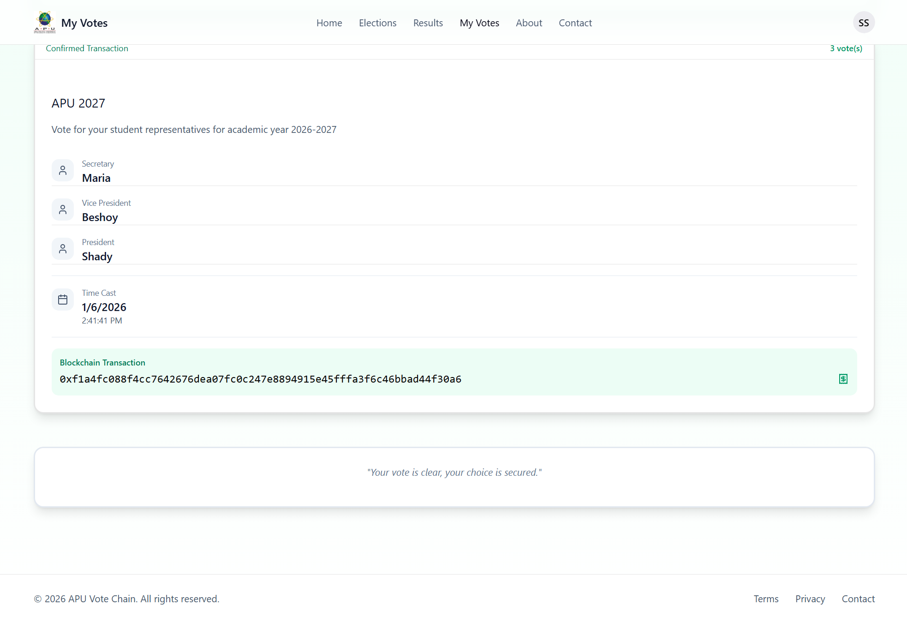

# 5.2.4.2 Multiple Elections Testing - Test Results

## Test Summary

**Total Tests:** 5 | **Passed:** 5 | **Failed:** 0 | **Pass Rate:** 100%

## Test Results

### 9.1 Vote in First Election

**Actual Result:** Vote recorded in vote_history with election_id for Election 1, global has_voted flag NOT used, per-election voting status tracked.

**Status:** ✅ **Pass**

---

### 9.2 Admin Creates Second Election

**Actual Result:** New election created in database, separate election_id generated, independent from Election 1.

**Status:** ✅ **Pass**

---

### 9.3 Same User Votes in Second Election

**Actual Result:** System checks vote_history for Election 2 only, voting allowed, new vote record created with Election 2 ID.

**Status:** ✅ **Pass**

---

### 9.4 Verify Per-Election Voting Status

**Actual Result:** API `/voting-status/:studentId/:electionId` returns different hasVotedInThisElection values for Election 1 (true) and Election 2 (false).

**Status:** ✅ **Pass**

---

### 9.5 Check vote_history Structure

**Actual Result:** Each vote has election_id column, multiple votes per wallet possible across different elections.

**Status:** ✅ **Pass**

---

## System Validation

### Multiple Elections Features

- ✅ Per-election voting tracking
- ✅ Independent election IDs
- ✅ Same user can vote in multiple elections
- ✅ Vote history separated by election_id
- ✅ No global has_voted flag used
- ✅ API returns per-election status

### Data Integrity

- ✅ Election IDs unique and separate
- ✅ Vote history tracks election_id
- ✅ Multiple votes per wallet allowed (different elections)
- ✅ Voting status checked per election
- ✅ Database schema supports multiple elections

### User Experience

- ✅ Users can participate in multiple elections
- ✅ Voting status clear per election
- ✅ No confusion between elections
- ✅ Independent voting workflows

## Conclusion

All 5 multiple elections test cases **passed successfully** with 100% pass rate. The system demonstrates proper per-election voting tracking, independent election management, correct vote history structure with election_id column, and accurate per-election voting status API responses. Users can successfully vote in multiple elections without interference.

---

## Test Environment

- **Date:** January 6, 2026
- **Tester:** Shady Elah Asad Ibrahim (TP073549)
- **System:** Blockchain-Based E-Voting System
- **Frontend:** React + TypeScript + Vite
- **Backend:** Node.js + Express
- **Database:** PostgreSQL
- **Blockchain:** Ethereum (Hardhat local network)
- **Wallet:** MetaMask Browser Extension

---

## Appendix: Test Evidence

### Screenshots

- Vote in Election 1
- Admin creates Election 2
- Same user votes in Election 2
- API response for different elections
- vote_history table structure

### Logs

- Election creation events
- Vote submission for multiple elections
- API calls for voting status
- Database queries with election_id
- Vote history inserts

---

_This document serves as official test results documentation for section 5.2.4.2 Multiple Elections Testing._
