# Blockchain-Based E-Voting System - Complete Architecture Guide

## Table of Contents

1. [High-Level System Architecture](#high-level-system-architecture)
2. [Component Details](#component-details)
3. [Voter Flow Architecture](#voter-flow-architecture)
4. [Admin Flow Architecture](#admin-flow-architecture)
5. [Data Flow Diagrams](#data-flow-diagrams)
6. [Technology Stack](#technology-stack)
7. [Security Architecture](#security-architecture)

---

## Visual Architecture Diagrams

### High-Level System Architecture Diagrams

**Original Design (Component-Based):**

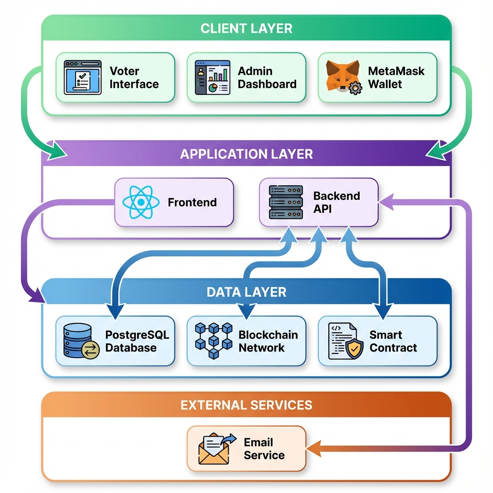

**Flowchart Design (Layer-Based):**

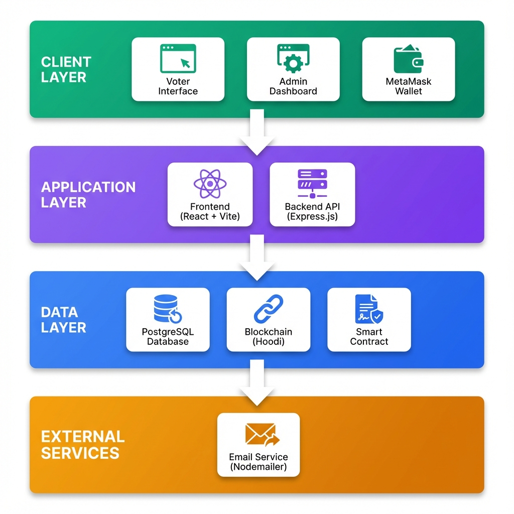

### Voter Journey Flow

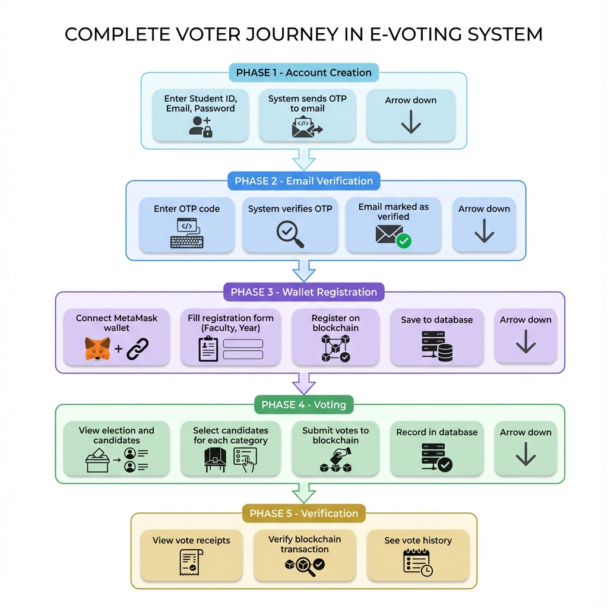

### Admin Journey Flow

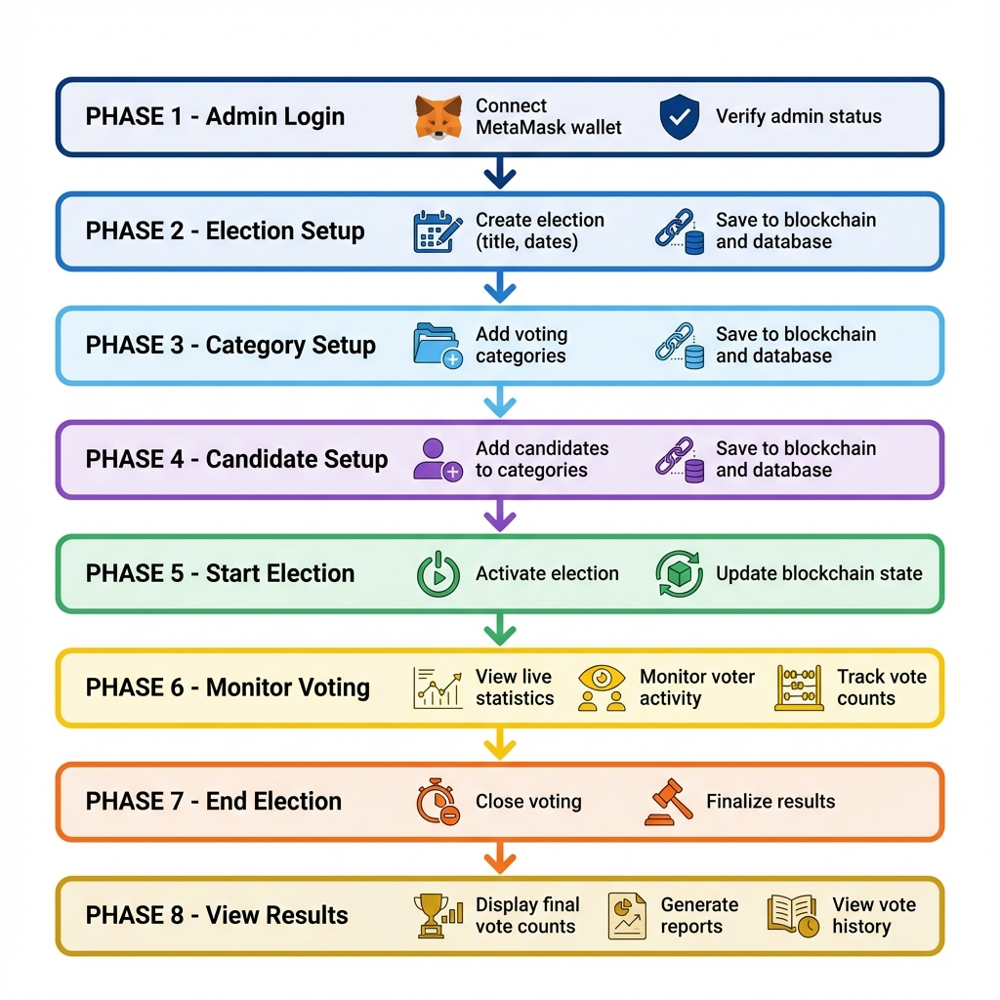

---

## High-Level System Architecture

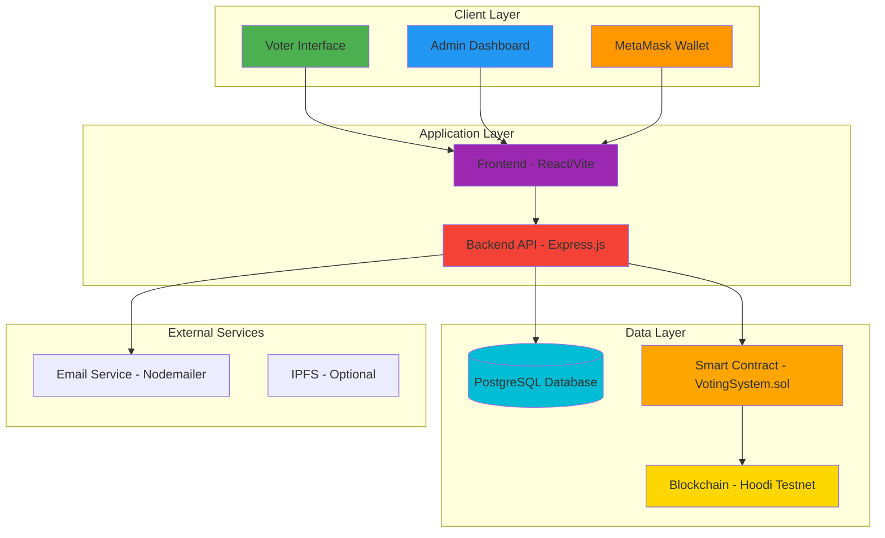

### Architecture Overview

Your e-voting system follows a **3-tier architecture** with blockchain integration:

1. **Presentation Layer**: React-based frontend with MetaMask integration
2. **Application Layer**: Express.js backend API server
3. **Data Layer**: Dual storage (PostgreSQL + Blockchain)

---

## Component Details

### 1. Frontend Components (React + Vite)

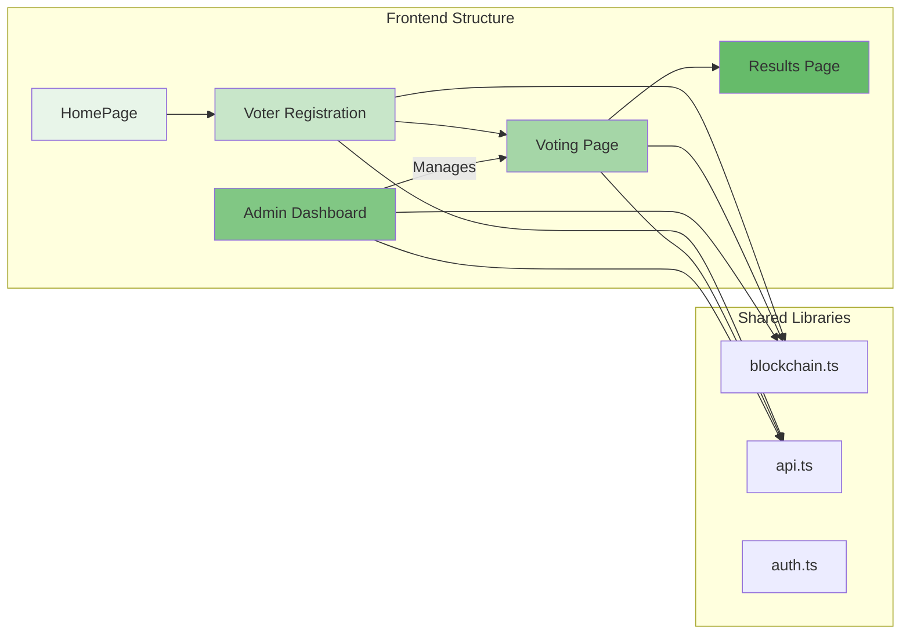

**Key Frontend Files:**

- `src/components/HomePage.tsx` - Landing page with election info
- `src/components/VoterRegistrationPage.tsx` - Voter registration form
- `src/components/VotePage.tsx` - Voting interface
- `src/components/AdminDashboard.tsx` - Admin control panel
- `src/lib/blockchain.ts` - Blockchain interaction layer
- `src/lib/api.ts` - Backend API calls

### 2. Backend Components (Express.js)

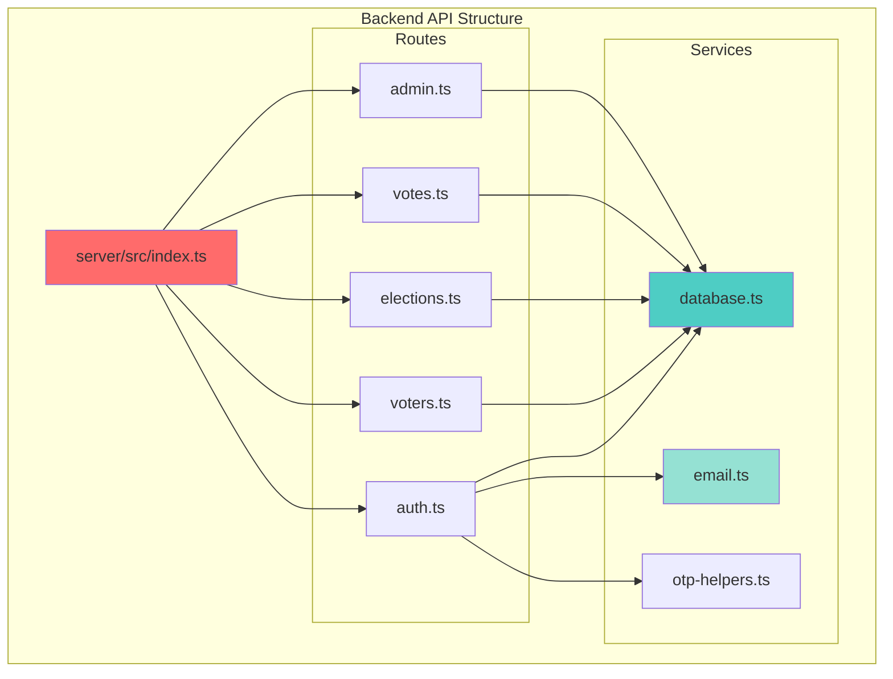

**Key Backend Files:**

- `server/src/index.ts` - Main server entry point
- `server/src/routes/` - API route handlers
- `server/src/database.ts` - PostgreSQL connection
- `server/src/email.ts` - Email OTP service

### 3. Database Schema (PostgreSQL)

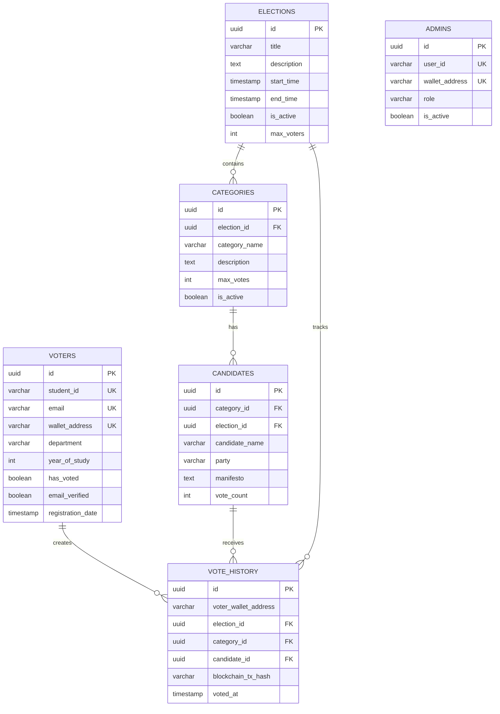

### 4. Smart Contract (Solidity)

**Contract Address**: `0x2DCa51f1095B2BbF7a5A1A8f6c0E7c7B8AD0e613` (Hoodi Testnet)

**Key Functions:**

- `createElection()` - Initialize new election
- `startElection()` - Activate voting
- `endElection()` - Close voting
- `registerVoter()` - Register voter on blockchain
- `createCategory()` - Add voting category
- `addCandidate()` - Add candidate to category
- `vote()` - Cast single vote
- `batchVote()` - Cast multiple votes at once
- `getMyVotes()` - Retrieve voter's vote receipts

---

## Voter Flow Architecture

### Complete Voter Journey

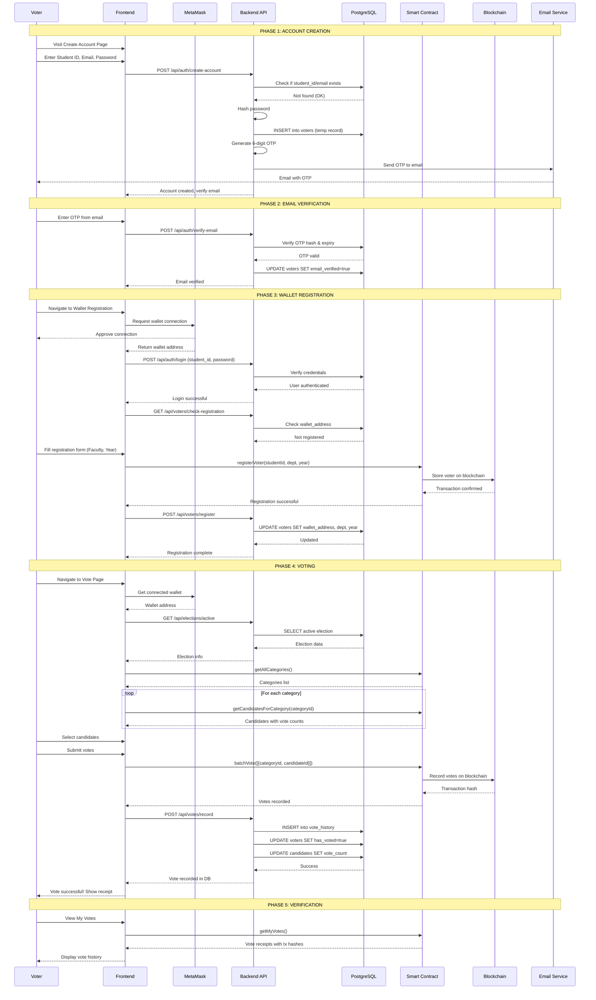

### Voter Connection Points

**What Voters Connect To:**

1. **Frontend (React App)**

   - URL: `http://[YOUR_IP]:5173` or `http://localhost:5173`
   - Purpose: User interface for all interactions

2. **MetaMask Wallet**

   - Network: Ethereum Hoodi Testnet
   - Purpose: Wallet authentication and transaction signing

3. **Backend API** (via Frontend)

   - URL: `http://[YOUR_IP]:3000/api`
   - Endpoints used:
     - `/api/auth/create-account` - Create account
     - `/api/auth/verify-email` - Verify OTP
     - `/api/auth/login` - Login
     - `/api/voters/register` - Register wallet
     - `/api/elections/active` - Get election info
     - `/api/votes/record` - Record vote

4. **Smart Contract** (via Frontend)

   - Address: `0x2DCa51f1095B2BbF7a5A1A8f6c0E7c7B8AD0e613`
   - Functions called:
     - `registerVoter()`
     - `getAllCategories()`
     - `getCandidatesForCategory()`
     - `batchVote()`
     - `getMyVotes()`

5. **Email Service** (receives emails)
   - Purpose: Receive OTP for verification

---

## Admin Flow Architecture

### Complete Admin Journey

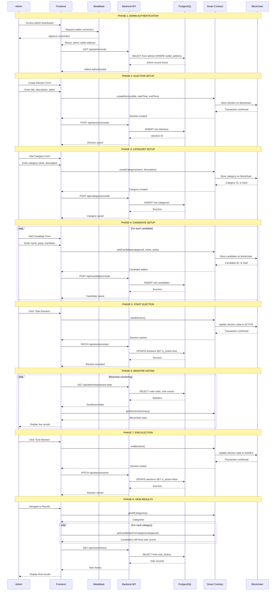

### Admin Connection Points

**What Admin Connects To:**

1. **Frontend (Admin Dashboard)**

   - URL: `http://[YOUR_IP]:5173/admin`
   - Purpose: Election management interface

2. **MetaMask Wallet**

   - Network: Ethereum Hoodi Testnet
   - Purpose: Admin authentication and transaction signing
   - Required: Admin wallet must be registered in `admins` table

3. **Backend API** (via Frontend)

   - URL: `http://[YOUR_IP]:3000/api`
   - Endpoints used:
     - `/api/admin/verify` - Verify admin status
     - `/api/elections/*` - Manage elections
     - `/api/categories/*` - Manage categories
     - `/api/candidates/*` - Manage candidates
     - `/api/admin/dashboard-stats` - Get statistics
     - `/api/votes/history` - View vote history

4. **Smart Contract** (via Frontend)

   - Address: `0x2DCa51f1095B2BbF7a5A1A8f6c0E7c7B8AD0e613`
   - Functions called:
     - `createElection()`
     - `startElection()`
     - `endElection()`
     - `resetSystem()`
     - `createCategory()`
     - `addCandidate()`
     - `getElectionSummary()`
     - `getAllCategories()`
     - `getCandidatesForCategory()`
     - `pauseSystem()` / `unpauseSystem()`

5. **PostgreSQL Database** (via Backend)
   - Purpose: Store election data, monitor voters, view audit logs

---

## Data Flow Diagrams

### Overall Data Flow

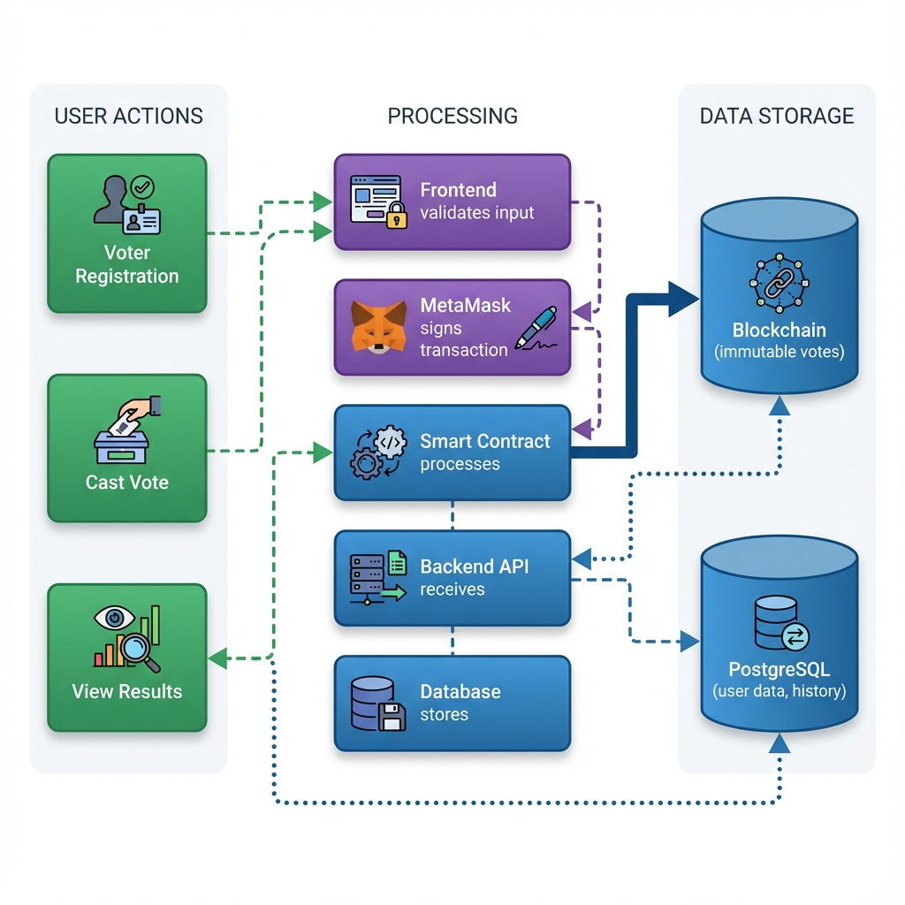

### Vote Recording Data Flow

```mermaid
graph TB
    subgraph "Vote Submission Flow"
        V1[Voter selects candidates]
        V2[Frontend validates selections]
        V3[Call batchVote on Smart Contract]
        V4[MetaMask prompts for signature]
        V5[Transaction sent to blockchain]
        V6[Blockchain confirms transaction]
        V7[Frontend receives tx hash]
        V8[Call Backend API to record vote]
        V9[Backend saves to vote_history]
        V10[Backend updates has_voted flag]
        V11[Backend updates candidate vote_count]
        V12[Success confirmation to voter]

        V1 --> V2
        V2 --> V3
        V3 --> V4
        V4 --> V5
        V5 --> V6
        V6 --> V7
        V7 --> V8
        V8 --> V9
        V9 --> V10
        V10 --> V11
        V11 --> V12
    end

    style V3 fill:#FFD700
    style V6 fill:#FFD700
    style V9 fill:#00BCD4
    style V10 fill:#00BCD4
```

### Registration Data Flow

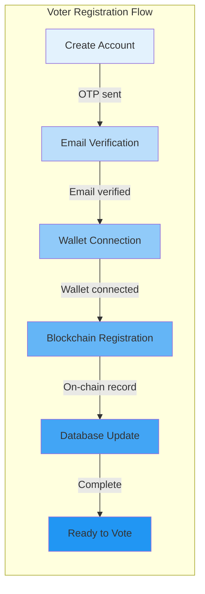

### Results Retrieval Flow

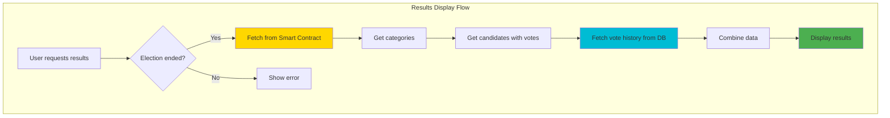

---

## Technology Stack

### Frontend Stack

- **Framework**: React 18 with TypeScript
- **Build Tool**: Vite
- **Blockchain Library**: ethers.js v6
- **Wallet**: MetaMask integration
- **UI Components**: Custom components
- **Routing**: React Router
- **State Management**: React hooks
- **Notifications**: Sonner (toast notifications)

### Backend Stack

- **Runtime**: Node.js
- **Framework**: Express.js
- **Language**: TypeScript
- **Database**: PostgreSQL 14+
- **ORM/Query**: Direct SQL queries with pg library
- **Email**: Nodemailer
- **Security**: bcrypt for password hashing
- **CORS**: Enabled for cross-origin requests

### Blockchain Stack

- **Network**: Ethereum Hoodi Testnet
- **Smart Contract Language**: Solidity
- **Contract Address**: `0x2DCa51f1095B2BbF7a5A1A8f6c0E7c7B8AD0e613`
- **Wallet Provider**: MetaMask
- **RPC Endpoint**: Hoodi testnet RPC

### Database Tables

1. **voters** - Voter accounts and registration
2. **elections** - Election metadata
3. **categories** - Voting categories
4. **candidates** - Candidate information
5. **vote_history** - Permanent vote records
6. **admins** - Admin accounts
7. **audit_logs** - System activity logs
8. **system_settings** - Configuration

---

## Security Architecture

### Multi-Layer Security

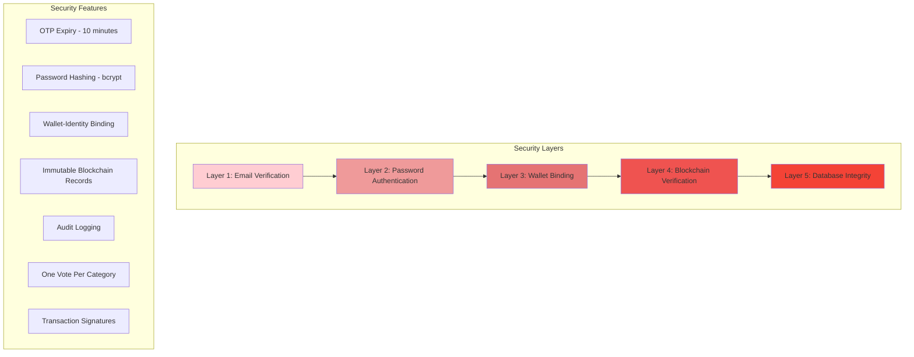

### Security Mechanisms

1. **Email Verification (OTP)**

   - 6-digit OTP sent to student email
   - 10-minute expiration
   - Maximum 3 attempts
   - Prevents unauthorized registrations

2. **Password Security**

   - bcrypt hashing with salt
   - Minimum password requirements
   - Secure storage in database

3. **Wallet-Identity Binding**

   - One wallet per student ID
   - Wallet address verified on each vote
   - Prevents vote manipulation

4. **Blockchain Immutability**

   - All votes recorded on blockchain
   - Cannot be altered or deleted
   - Transparent and verifiable

5. **Double Recording**

   - Votes stored on blockchain AND database
   - Cross-verification possible
   - Redundancy for integrity

6. **Admin Access Control**
   - Wallet-based authentication
   - Role-based permissions
   - Audit trail of admin actions

---

## Summary: How Everything Connects

### Voter Perspective

1. **Create Account** → Backend API → PostgreSQL
2. **Verify Email** → Email Service → Backend API → PostgreSQL
3. **Connect Wallet** → MetaMask → Frontend
4. **Register** → Smart Contract → Blockchain + Backend API → PostgreSQL
5. **Vote** → Smart Contract → Blockchain + Backend API → PostgreSQL
6. **Verify** → Smart Contract → Display receipts

### Admin Perspective

1. **Login** → MetaMask → Backend API → PostgreSQL (verify admin)
2. **Create Election** → Smart Contract → Blockchain + Backend API → PostgreSQL
3. **Add Categories** → Smart Contract → Blockchain + Backend API → PostgreSQL
4. **Add Candidates** → Smart Contract → Blockchain + Backend API → PostgreSQL
5. **Start Election** → Smart Contract → Blockchain + Backend API → PostgreSQL
6. **Monitor** → Backend API → PostgreSQL + Smart Contract → Blockchain
7. **End Election** → Smart Contract → Blockchain + Backend API → PostgreSQL
8. **View Results** → Smart Contract → Blockchain + Backend API → PostgreSQL

### Data Storage

- **Blockchain**: Votes, voter registrations, election state, categories, candidates
- **PostgreSQL**: User accounts, emails, passwords, vote history, audit logs, election metadata
- **Why Both?**: Blockchain for immutability and transparency, Database for efficient queries and user management

---

## Next Steps for Building Diagrams

If you want to create visual diagrams manually, here are the recommended tools:

1. **Draw.io (diagrams.net)** - Free, web-based
2. **Lucidchart** - Professional diagrams
3. **Mermaid Live Editor** - For mermaid diagrams
4. **Microsoft Visio** - Enterprise solution
5. **Figma** - For UI/UX focused diagrams

The mermaid diagrams above can be copied directly into any markdown viewer or mermaid editor!
