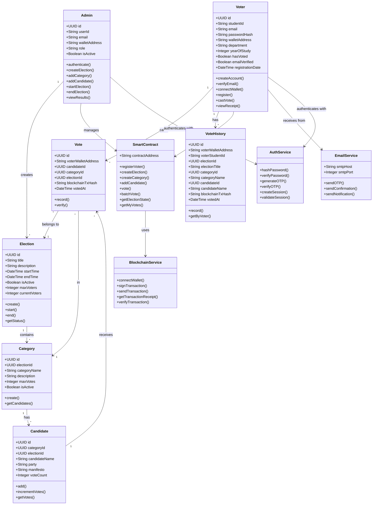
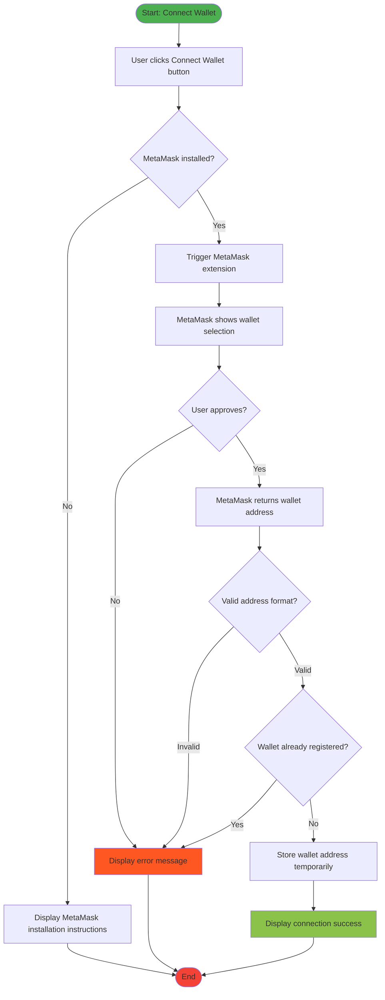
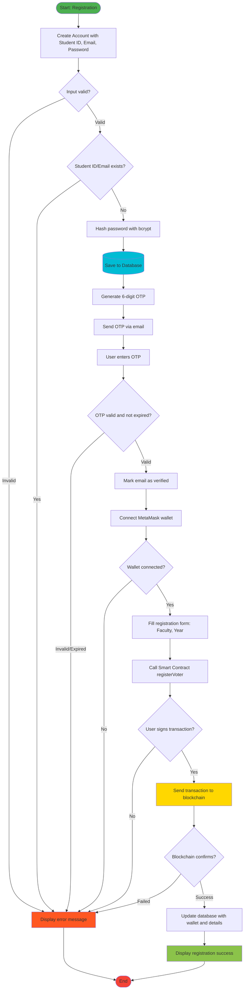

# UML Diagrams for Blockchain E-Voting System

## Table of Contents

1. [Use Case Diagram](#use-case-diagram)
2. [Use Case Specifications](#use-case-specifications)
3. [Class Diagram](#class-diagram)
4. [Activity Diagrams](#activity-diagrams)

---

## Use Case Diagram

```mermaid
graph TB
    subgraph "Blockchain E-Voting System"
        subgraph "Voter Use Cases"
            UC1[Create Account]
            UC2[Verify Email]
            UC3[Connect Wallet]
            UC4[Register as Voter]
            UC5[View Elections]
            UC6[View Candidates]
            UC7[Cast Vote]
            UC8[View Vote Receipt]
            UC9[Verify Vote on Blockchain]
        end

        subgraph "Admin Use Cases"
            UC10[Login as Admin]
            UC11[Create Election]
            UC12[Add Category]
            UC13[Add Candidate]
            UC14[Start Election]
            UC15[Monitor Voting]
            UC16[End Election]
            UC17[View Results]
            UC18[Manage System Settings]
            UC19[View Audit Logs]
            UC20[Reset System]
        end

        subgraph "System Use Cases"
            UC21[Send OTP Email]
            UC22[Validate Credentials]
            UC23[Record Vote on Blockchain]
            UC24[Store Data in Database]
            UC25[Generate Vote Receipt]
        end
    end

    Voter((Voter))
    Admin((Admin))
    EmailSystem((Email System))
    Blockchain((Blockchain))
    Database((Database))

    Voter --> UC1
    Voter --> UC2
    Voter --> UC3
    Voter --> UC4
    Voter --> UC5
    Voter --> UC6
    Voter --> UC7
    Voter --> UC8
    Voter --> UC9

    Admin --> UC10
    Admin --> UC11
    Admin --> UC12
    Admin --> UC13
    Admin --> UC14
    Admin --> UC15
    Admin --> UC16
    Admin --> UC17
    Admin --> UC18
    Admin --> UC19
    Admin --> UC20

    UC1 -.-> UC21
    UC2 -.-> UC22
    UC4 -.-> UC23
    UC7 -.-> UC23
    UC7 -.-> UC24
    UC7 -.-> UC25
    UC11 -.-> UC23
    UC11 -.-> UC24

    UC21 --> EmailSystem
    UC23 --> Blockchain
    UC24 --> Database

    style Voter fill:#4CAF50
    style Admin fill:#2196F3
    style EmailSystem fill:#FF9800
    style Blockchain fill:#FFD700
    style Database fill:#00BCD4
```

---

## Use Case Specifications

### 1. Voter Use Cases

#### UC1: Create Account

**Actor:** Voter  
**Preconditions:** None  
**Postconditions:** Account created with unverified email status

**Main Flow:**

1. Voter navigates to Create Account page
2. System displays registration form
3. Voter enters Student ID, Email, and Password
4. System validates input format
5. System checks if Student ID or Email already exists
6. System hashes password using bcrypt
7. System creates voter record in database
8. System generates 6-digit OTP
9. System sends OTP to voter's email
10. System displays OTP verification page

**Alternative Flows:**

- 5a. Student ID already exists → Display error, return to step 3
- 5b. Email already exists → Display error, return to step 3
- 9a. Email sending fails → Display error, allow resend

**Business Rules:**

- Student ID must be unique
- Email must be valid university email format
- Password must meet minimum security requirements
- OTP expires after 10 minutes
- Maximum 3 OTP attempts allowed

---

#### UC2: Verify Email

**Actor:** Voter  
**Preconditions:** Account created, OTP sent to email  
**Postconditions:** Email verified, account activated

**Main Flow:**

1. Voter receives OTP via email
2. Voter enters OTP in verification form
3. System validates OTP against stored hash
4. System checks OTP expiration time
5. System marks email as verified
6. System updates voter record
7. System displays success message
8. System redirects to wallet registration

**Alternative Flows:**

- 3a. Invalid OTP → Increment attempt counter, display error
- 3b. Maximum attempts reached → Lock account, require admin intervention
- 4a. OTP expired → Display error, offer to resend new OTP

---

#### UC3: Connect Wallet

**Actor:** Voter  
**Preconditions:** Email verified  
**Postconditions:** MetaMask wallet connected

**Main Flow:**

1. Voter clicks "Connect Wallet" button
2. System triggers MetaMask extension
3. MetaMask prompts for wallet selection
4. Voter selects wallet and approves connection
5. MetaMask returns wallet address to system
6. System validates wallet address format
7. System checks if wallet already registered
8. System stores wallet address temporarily
9. System displays wallet connection success

**Alternative Flows:**

- 2a. MetaMask not installed → Display installation instructions
- 4a. Voter rejects connection → Display error, allow retry
- 7a. Wallet already registered → Display error, prevent duplicate registration

---

#### UC4: Register as Voter

**Actor:** Voter  
**Preconditions:** Email verified, wallet connected  
**Postconditions:** Voter registered on blockchain and database

**Main Flow:**

1. Voter fills registration form (Faculty, Year of Study)
2. System validates form data
3. System calls smart contract `registerVoter()` function
4. MetaMask prompts for transaction signature
5. Voter approves transaction
6. Transaction sent to blockchain
7. Blockchain confirms registration
8. System receives transaction hash
9. System updates database with wallet address and details
10. System displays registration success

**Alternative Flows:**

- 4a. Voter rejects transaction → Cancel registration, return to form
- 6a. Transaction fails → Display error, allow retry
- 7a. Blockchain rejects (already registered) → Display error

---

#### UC7: Cast Vote

**Actor:** Voter  
**Preconditions:** Voter registered, election active, not yet voted  
**Postconditions:** Vote recorded on blockchain and database

**Main Flow:**

1. Voter views active election and categories
2. System displays candidates for each category
3. Voter selects one candidate per category
4. Voter reviews selections
5. Voter clicks "Submit Vote"
6. System validates selections (one per category)
7. System calls smart contract `batchVote()` function
8. MetaMask prompts for transaction signature
9. Voter approves transaction
10. Transaction sent to blockchain
11. Blockchain records votes immutably
12. System receives transaction hash
13. System records vote in database
14. System updates voter's `has_voted` status
15. System generates vote receipt
16. System displays confirmation with receipt

**Alternative Flows:**

- 6a. Invalid selections → Display error, return to step 3
- 9a. Voter rejects transaction → Cancel vote, return to review
- 11a. Blockchain rejects (already voted) → Display error
- 11b. Transaction fails → Display error, allow retry

**Business Rules:**

- One vote per category per voter
- Cannot change vote after submission
- Must vote in all categories or none
- Election must be in active state

---

### 2. Admin Use Cases

#### UC11: Create Election

**Actor:** Admin  
**Preconditions:** Admin authenticated  
**Postconditions:** Election created on blockchain and database

**Main Flow:**

1. Admin navigates to Create Election page
2. System displays election creation form
3. Admin enters title, description, start time, end time
4. System validates input (end time > start time)
5. System calls smart contract `createElection()` function
6. MetaMask prompts for transaction signature
7. Admin approves transaction
8. Transaction sent to blockchain
9. Blockchain creates election record
10. System receives transaction confirmation
11. System creates election record in database
12. System displays success message

**Alternative Flows:**

- 4a. Invalid dates → Display error, return to step 3
- 7a. Admin rejects transaction → Cancel creation
- 9a. Transaction fails → Display error, allow retry

---

#### UC12: Add Category

**Actor:** Admin  
**Preconditions:** Election created  
**Postconditions:** Category added to election

**Main Flow:**

1. Admin selects election
2. Admin clicks "Add Category"
3. System displays category form
4. Admin enters category name and description
5. System calls smart contract `createCategory()` function
6. MetaMask prompts for signature
7. Admin approves transaction
8. Blockchain creates category
9. System receives category ID and transaction hash
10. System creates category record in database
11. System displays success message

---

#### UC13: Add Candidate

**Actor:** Admin  
**Preconditions:** Category created  
**Postconditions:** Candidate added to category

**Main Flow:**

1. Admin selects category
2. Admin clicks "Add Candidate"
3. System displays candidate form
4. Admin enters name, party, manifesto
5. System calls smart contract `addCandidate()` function
6. MetaMask prompts for signature
7. Admin approves transaction
8. Blockchain adds candidate
9. System receives candidate ID and transaction hash
10. System creates candidate record in database
11. System displays success message

---

#### UC14: Start Election

**Actor:** Admin  
**Preconditions:** Election created, categories and candidates added  
**Postconditions:** Election state changed to Active

**Main Flow:**

1. Admin clicks "Start Election"
2. System validates election setup (has categories and candidates)
3. System calls smart contract `startElection()` function
4. MetaMask prompts for signature
5. Admin approves transaction
6. Blockchain updates election state to Active
7. System updates database election status
8. System displays success message
9. Voters can now cast votes

**Alternative Flows:**

- 2a. No categories → Display error, prevent start
- 2b. No candidates → Display error, prevent start

---

#### UC16: End Election

**Actor:** Admin  
**Preconditions:** Election active  
**Postconditions:** Election ended, results finalized

**Main Flow:**

1. Admin clicks "End Election"
2. System confirms action
3. Admin confirms
4. System calls smart contract `endElection()` function
5. MetaMask prompts for signature
6. Admin approves transaction
7. Blockchain updates election state to Ended
8. System updates database election status
9. System displays success message
10. Results become available

---

## Class Diagram

---

## Activity Diagrams

### Activity Diagram 1: Connect Wallet

### Activity Diagram 2: Voter Registration Process

### Activity Diagram 3: Voting Process

```mermaid
flowchart TD
    Start([Start: Voting])
    Login[Login with credentials]
    CheckAuth{Authenticated?}
    CheckRegistered{Voter registered?}
    CheckElection{Election active?}
    CheckVoted{Already voted?}
    ViewElection[View election details]
    ViewCategories[View categories]
    ViewCandidates[View candidates for each category]
    SelectCandidates[Select one candidate per category]
    ReviewSelections[Review selections]
    ConfirmVote{Confirm vote?}
    ValidateSelections{All categories selected?}
    CallBatchVote[Call Smart Contract batchVote]
    SignTransaction{Sign transaction?}
    SendToBlockchain[Send to blockchain]
    BlockchainRecord{Blockchain records?}
    GetTxHash[Receive transaction hash]
    RecordDB[(Record in database)]
    UpdateVoterStatus[Update has_voted = true]
    GenerateReceipt[Generate vote receipt]
    ShowReceipt[Display receipt with tx hash]
    ShowError[Display error]
    End([End])

    Start --> Login
    Login --> CheckAuth
    CheckAuth -->|No| ShowError
    CheckAuth -->|Yes| CheckRegistered
    CheckRegistered -->|No| ShowError
    CheckRegistered -->|Yes| CheckElection
    CheckElection -->|No| ShowError
    CheckElection -->|Yes| CheckVoted
    CheckVoted -->|Yes| ShowError
    CheckVoted -->|No| ViewElection
    ViewElection --> ViewCategories
    ViewCategories --> ViewCandidates
    ViewCandidates --> SelectCandidates
    SelectCandidates --> ReviewSelections
    ReviewSelections --> ConfirmVote
    ConfirmVote -->|No| SelectCandidates
    ConfirmVote -->|Yes| ValidateSelections
    ValidateSelections -->|Invalid| ShowError
    ValidateSelections -->|Valid| CallBatchVote
    CallBatchVote --> SignTransaction
    SignTransaction -->|No| ShowError
    SignTransaction -->|Yes| SendToBlockchain
    SendToBlockchain --> BlockchainRecord
    BlockchainRecord -->|Failed| ShowError
    BlockchainRecord -->|Success| GetTxHash
    GetTxHash --> RecordDB
    RecordDB --> UpdateVoterStatus
    UpdateVoterStatus --> GenerateReceipt
    GenerateReceipt --> ShowReceipt
    ShowReceipt --> End
    ShowError --> End

    style Start fill:#4CAF50
    style End fill:#F44336
    style ShowReceipt fill:#8BC34A
    style ShowError fill:#FF5722
    style RecordDB fill:#00BCD4
    style SendToBlockchain fill:#FFD700
```

### Activity Diagram 4: Admin Election Setup

```mermaid
flowchart TD
    Start([Start: Election Setup])
    AdminLogin[Admin connects wallet]
    VerifyAdmin{Admin verified?}
    CreateElectionForm[Fill election form: Title, Description, Dates]
    ValidateDates{End time > Start time?}
    CallCreateElection[Call Smart Contract createElection]
    SignTx1{Sign transaction?}
    BlockchainCreate1{Blockchain confirms?}
    SaveElectionDB[(Save election to database)]

    AddCategoryForm[Fill category form: Name, Description]
    CallCreateCategory[Call Smart Contract createCategory]
    SignTx2{Sign transaction?}
    BlockchainCreate2{Blockchain confirms?}
    SaveCategoryDB[(Save category to database)]
    MoreCategories{Add more categories?}

    AddCandidateForm[Fill candidate form: Name, Party, Manifesto]
    CallAddCandidate[Call Smart Contract addCandidate]
    SignTx3{Sign transaction?}
    BlockchainCreate3{Blockchain confirms?}
    SaveCandidateDB[(Save candidate to database)]
    MoreCandidates{Add more candidates?}

    ReviewSetup[Review complete setup]
    StartElection{Start election now?}
    CallStartElection[Call Smart Contract startElection]
    SignTx4{Sign transaction?}
    BlockchainStart{Blockchain confirms?}
    UpdateElectionStatus[Update election status to Active]
    ShowSuccess[Display success: Election is live]
    ShowError[Display error]
    End([End])

    Start --> AdminLogin
    AdminLogin --> VerifyAdmin
    VerifyAdmin -->|No| ShowError
    VerifyAdmin -->|Yes| CreateElectionForm
    CreateElectionForm --> ValidateDates
    ValidateDates -->|No| ShowError
    ValidateDates -->|Yes| CallCreateElection
    CallCreateElection --> SignTx1
    SignTx1 -->|No| ShowError
    SignTx1 -->|Yes| BlockchainCreate1
    BlockchainCreate1 -->|Failed| ShowError
    BlockchainCreate1 -->|Success| SaveElectionDB

    SaveElectionDB --> AddCategoryForm
    AddCategoryForm --> CallCreateCategory
    CallCreateCategory --> SignTx2
    SignTx2 -->|No| ShowError
    SignTx2 -->|Yes| BlockchainCreate2
    BlockchainCreate2 -->|Failed| ShowError
    BlockchainCreate2 -->|Success| SaveCategoryDB
    SaveCategoryDB --> MoreCategories
    MoreCategories -->|Yes| AddCategoryForm
    MoreCategories -->|No| AddCandidateForm

    AddCandidateForm --> CallAddCandidate
    CallAddCandidate --> SignTx3
    SignTx3 -->|No| ShowError
    SignTx3 -->|Yes| BlockchainCreate3
    BlockchainCreate3 -->|Failed| ShowError
    BlockchainCreate3 -->|Success| SaveCandidateDB
    SaveCandidateDB --> MoreCandidates
    MoreCandidates -->|Yes| AddCandidateForm
    MoreCandidates -->|No| ReviewSetup

    ReviewSetup --> StartElection
    StartElection -->|No| End
    StartElection -->|Yes| CallStartElection
    CallStartElection --> SignTx4
    SignTx4 -->|No| ShowError
    SignTx4 -->|Yes| BlockchainStart
    BlockchainStart -->|Failed| ShowError
    BlockchainStart -->|Success| UpdateElectionStatus
    UpdateElectionStatus --> ShowSuccess
    ShowSuccess --> End
    ShowError --> End

    style Start fill:#2196F3
    style End fill:#F44336
    style ShowSuccess fill:#8BC34A
    style ShowError fill:#FF5722
    style SaveElectionDB fill:#00BCD4
    style SaveCategoryDB fill:#00BCD4
    style SaveCandidateDB fill:#00BCD4
```

---

## Summary

This document provides comprehensive UML diagrams for the blockchain-based e-voting system:

- **Use Case Diagram**: Shows all actors and their interactions with the system
- **Use Case Specifications**: Detailed descriptions of main use cases with flows and business rules
- **Class Diagram**: Complete system structure with all entities and relationships
- **Activity Diagrams**: Step-by-step processes for wallet connection, registration, voting, and admin setup

These diagrams are suitable for academic FYP documentation and clearly illustrate the system's functionality and architecture.
